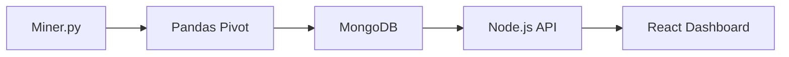

# WEG Product Intelligence Platform

[](https://www.python.org/)
[](https://nodejs.org/)
[](https://reactjs.org/)
[](https://mongodb.com/)
[](https://selenium.dev/)
[](LICENSE)

---

## Overview

A **full-stack data platform** that:
- **Scrapes** WEG product catalog using **Selenium + Async Python**
- **Cleans & pivots** data with **Pandas**
- **Stores** structured data in **MongoDB**
- **Serves** via **Node.js + Express REST API**
- **Visualizes** in a **React + Vite dashboard** with auth, pagination, and live filtering

> **One source of truth. Zero data duplication.**

---

## Project Structure

```
.
├── api/
│   └── back-end/               # Node.js API server
│       ├── models/             # Mongoose schemas
│       ├── routes/             # API endpoints
│       ├── server.js
│       └── package.json
├── dashboards/
│   └── front-end/              # Legacy static demos
├── data/                       # Raw & processed outputs
│   ├── weg_products_final.csv
│   └── grouped_products_final.csv
├── etl/                        # Extraction, Transform, Load
│   ├── Miner.py                # Async Selenium scraper (core)
│   ├── Pivoter.py              # Data pivoting
│   └── *.py                    # Experiments & drafts
├── front-end/                  # React + Vite Dashboard
│   ├── src/
│   │   ├── auth/               # Login, Register, JWT
│   │   ├── dashboard/          # Product table, filters, charts
│   │   ├── App.jsx
│   │   └── main.jsx
│   ├── public/
│   └── vite.config.js
├── logs/                       # Scraper & API logs
├── test/                       # Unit tests & experiments
├── .env                        # Secrets (MongoDB, JWT, paths)
├── .gitignore
├── LICENSE
└── README.md
```

---

## Tech Stack

| Layer        | Technology |
|-------------|------------|
| **Scraping** | Python, Selenium, BeautifulSoup, AsyncIO |
| **ETL**      | Pandas, CSV → MongoDB |
| **Backend**  | Node.js, Express, Mongoose, CORS |
| **Frontend** | React 18, Vite, Tailwind/CSS, React Query |
| **Database** | MongoDB (flexible schema for dynamic specs) |
| **Auth**     | JWT + LocalStorage |
| **DevOps**   | Git, `.env`, logging, `tqdm`, driver pooling |

---

## Features

- **Resilient scraping** with driver pooling & retry logic
- **Dynamic product spec extraction** (any field, any depth)
- **Pivoted wide-format data** for easy querying
- **Paginated API** (`/api/products?page=1&limit=50`)
- **Secure auth flow** (Login → JWT → Protected dashboard)
- **Live React table** with search, sort, and export
- **Dark mode + WEG branding** ready

---

## How It Works



1. `Miner.py` → Crawls WEG catalog → Saves raw + pivoted CSVs
2. Data → **Upserted into MongoDB** (unique by `Product URL`)
3. `server.js` → Serves `/api/products` with pagination
4. React → Fetches, filters, displays in real time

---

## Quick Start

### 1. Clone & Setup
```bash
git clone <your-repo>
cd <your-repo>
```

### 2. Install Dependencies
```bash
# Backend
cd api/back-end && npm install

# Frontend
cd ../../front-end && npm install

# Python ETL
pip install -r requirements.txt  # (create if missing)
```

### 3. Setup `.env`
```env
MONGODB_URI=mongodb://localhost:27017/weg_scraper
JWT_SECRET=your_strong_secret_here
CHROMEDRIVER_PATH=C:\chromedriver\chromedriver.exe
PORT=5000
```

### 4. Run Pipeline
```bash
# 1. Start MongoDB
mongod

# 2. Run Scraper (once)
cd etl
python Miner.py

# 3. Start API
cd ../api/back-end
node server.js

# 4. Start Dashboard
cd ../../front-end
npm run dev
```

Visit: `http://localhost:5173`

---

## API Endpoints

| Route | Method | Description |
|------|--------|-------------|
| `POST /api/auth/login` | POST | Get JWT |
| `GET /api/products` | GET | Paginated products (`?page=1&limit=50`) |

---

## Roadmap

| Status | Feature |
|---|--------|
| Done | Async scraper with driver pool |
| Done | Pandas pivot + MongoDB upsert |
| Done | Node.js API with pagination |
| Done | React dashboard with auth |
| In Progress | Search & filter (by spec, voltage, type) |
| In Progress | CSV/Excel export |
| Planned | Scheduled scraper (cron/APScheduler) |
| Planned | Deploy: Render (API) + Vercel (Frontend) |

---

## Contributing

1. Fork → Create branch → Code → Test → PR
2. Follow **Conventional Commits**
3. Add tests in `test/`

> Issues, ideas, and PRs welcome!

---

## Author

**Deyvid Barcelos**  
*Robotics Enthusiast | Full-Stack Data | Web Scraper Extraordinaire*

[](https://github.com/BarDeyvid)  
[](https://www.linkedin.com/in/deyvid-barcelos/)

---

## License

[Apache 2.0](LICENSE) – Free to use, modify, and distribute.

---

> **"I don’t just collect data — I turn catalogs into intelligence."**  
> — *Deyvid, 3 weeks in, 1 all-nighter to go*

---